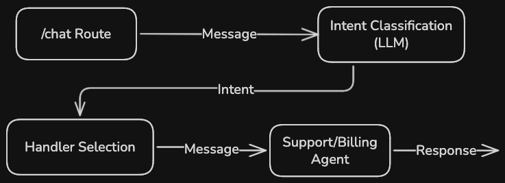

# AI Agent Router

### Problem: 
Modern AI applications are no longer single-purpose chatbots — they are composed of multiple specialized agents responsible for different domains (e.g., billing, support, operations).

A key challenge is **routing user requests to the right agent reliably and efficiently**.

### Solution:
This project introduces a lightweight **AI Agent Router**, a backend component responsible for:
- Classifying user intent using an LLM
- Delegating execution to specialized handlers
- Ensuring resilience through fallback mechanisms

The goal is to demonstrate how to design a **modular, production-ready orchestration layer** for AI systems, inspired by real-world platforms.

---

## Overview

The AI Agent Router acts as an orchestration layer:

1. Receives user input via an HTTP API
2. Uses an LLM to classify intent
3. Routes the request to the appropriate domain-specific handler or agent
4. Returns a structured response

The system is designed to be easily extensible (plug new agents/handlers).

---

## Flow



---

## Tech Stack

- **TypeScript**
- **Node.js / Express**
- **OpenAI-compatible API via OpenRouter for LLM integration**
- **dotenv** for configuration

---

## Project Structure
```
src/
├── agent/
│ ├── agentRouter.ts
│ └── intentClassifier.ts
├── handlers/
│ ├── billingHandler.ts
│ ├── supportAIHandler.ts
│ └── fallbackHandler.ts
├── types/
│ ├── intents.ts
│ └── agent.ts
├── routes/
| └── chat.ts
└── server.ts
```

## Setup

### 1. Install dependencies

```npm install```

### 2. Configure environment variables
```
OPENROUTER_API_KEY=your_api_key_here
OPENROUTER_API_BASE_URL=https://openrouter.ai/api/v1
OPENROUTER_MODEL=stepfun/step-3.5-flash:free
```
You should generate an API key from `https://openrouter.ai/workspaces/default/keys` to use their API and interact with their LLM models.

### 3. Run the Project

```npm run dev```

Server runs on `http://localhost:3000`

### 4. Test the `/chat` route

``` bash
curl -X POST http://localhost:3000/chat \
-H "Content-Type: application/json" \
-d '{"message":"I have a problem with my account"}'
```
\* This message should be treated with the support agent.

## Add a new agent

1. Create a new handler in `/handlers`

2. Add intent mapping in agentRouter.ts

3. Update classifier prompt

## Future Improvements

- Add conversation memory

- Add a single source of truth for available intents to minimize coupling between sub-system logics

- Add unit and integration tests

- Add frontend UI for interaction